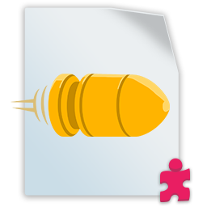
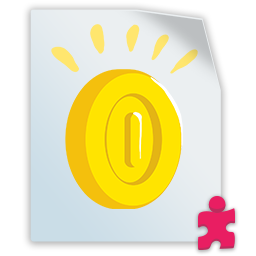
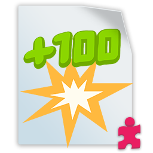
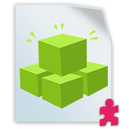
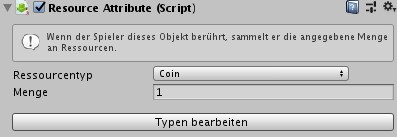
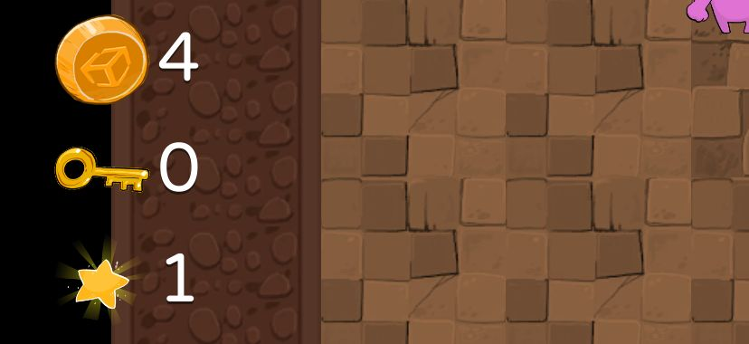
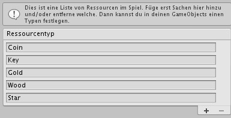

# Attribute

Attribute sind eine Kategorie von Skripten, die normalerweise nicht viel für sich tun: Sie definieren lediglich Eigenschaften, die ein Objekt hat, und dann wird ein anderes Skript basierend auf diesen Attributen handeln. Diese haben eine ähnliche Rolle wie Tags, können jedoch als Skripte mit zusätzlichen Daten geliefert werden.

## BulletAttribute

!> Benötigt einen `Collider2D`

Das `BulletAttribute`-Skript hat keine eigene Funktionalität, enthält jedoch einen Verweis darauf, von welchem Player das Projektil abgefeuert wurde. Diese Nummer (`playerID` im Code) kann 0 (Spieler 1) oder 1 (Spieler 2) sein.

Die ID wird automatisch vom [ObjectShooter](de/components/gameplay#objectshooter)-Skript festgelegt, wenn das Projektil gestartet wird.

> Hinweis: Wenn du aus irgendeinem Grund die `playerID`-Eigenschaft im Inspector festlegen möchten, öffne das `BulletAttribute`-Skript und entferne das Attribut `[HideInInspector]`.
>
> Dies kann hilfreich sein, wenn die Projektile von einem Skript erstellt werden, das kein [ObjectShooter](de/components/gameplay#objectshooter) ist.

## CollectableAttribute

!> Benötigt einen `Collider2D`

`CollectableAttribute` vergibt einen Punkt an jeden Spieler, der das Objekt berührt. Als solches erfordert es einen `Collider2D` und möglicherweise, dass `Ist Auslöser` aktiviert ist, um Kollisionen zu vermeiden.

Die einzige Eigenschaft, `Wert (Punkte)`, ermöglicht es, jedem Objekt einen anderen Wert zuzuweisen.

> Hinweis: Um die Gesamtpunktzahl auf dem Bildschirm anzuzeigen, muss in der Szene ein UI-Prefab vorhanden sein. Weitere Informationen zum UI-Prefab finden Sie im Bereich [Erste Schritte](de/getting-started.md).

## DestroyForPointsAttribute

!> Benötigt einen `Collider2D`

`DestroyForPointsAttribute` eignet sich für Ziele und Feinde in Shooter-Spielen. Es zerstört das GameObject bei einer Kollision mit einem anderen Objekt, nur wenn dieses das [BulletAttribute](#bulletattribute)-Skript hat. Außerdem erhält der Spieler, der ursprünglich auf die Kugel geschossen hat, Punkte.

Weitere Informationen zum Zuweisen von IDs zu Projektilen findest du in [BulletAttribute](#bulletattribute)- und [ObjectShooter](de/components/gameplay#objectshooter)-Skripts.

> Hinweis: Um die Gesamtpunktzahl auf dem Bildschirm anzuzeigen, muss in der Szene ein UI-Prefab vorhanden sein. Weitere Informationen zum UI-Prefab finden Sie im Bereich [Erste Schritte](de/getting-started.md).

## HealthSystemAttribute

!> Benötigt _nichts_

Das `HealthSystemAttribute` kann Charakteren, Feinden oder Objekten "Leben" hinzugefügt werden. Es erlaubt ihnen, Schaden zu erleiden und möglicherweise aus dem Spiel entfernt zu werden, wenn dies auf 0 geht - was im Fall des Spielers ein Spielende bedeuten könnte.

Das Skript arbeitet mit dem [ModifyHealthAttribute](#modifyhealthattribute) zusammen, welches auch für Projektile erforderlich ist. Ebenso hat ein Objekt mit [ModifyHealthAttribute](#modifyhealthattribute) keine Auswirkungen auf ein Objekt ohne `HealthSystemAttribute`.

`HealthSystemAttribute` benötigt keinen `Collider2D`, es wird jedoch empfohlen, einen zu haben, wenn du dich auf Kollisionen verlassen willst, um die Gesundheit von einem Spieler abzuziehen.

> Hinweis: Um die Gesamtpunktzahl auf dem Bildschirm anzuzeigen, muss in der Szene ein UI-Prefab vorhanden sein. Weitere Informationen zum UI-Prefab finden Sie im Bereich [Erste Schritte](de/getting-started.md).

## ModifyHealthAttribute

!> Benötigt einen `Collider2D`

Mit diesem Attribut kann jedes physische Objekt einen Zustand zu jedem Objekt mit einem [HealthSystemAttribute](#healthsystemattribute) subtrahieren oder addieren. Es ist nützlich für Kugeln, Gefahrenzonen usw., aber auch für Dinge, die heilen können, wie Medipacks, Lebensmittel und mehr.

`Bei Aktivierung zerstören` ist eine Eigenschaft, die, wenn sie aktiviert ist, dieses Objekt zerstört, nachdem es seine Effekte erzeugt. Verwenden Sie es für Kugeln, Verbrauchsmaterialien und alles, was nur einmal wirken muss.

Die Eigenschaft "Lebensänderung" gibt die von diesem Objekt verursachten Schaden oder Heilung an. Wenn der Wert negativ ist, ist fügt es schaden hinzu. Bei positiven Werten heilt es. Die letzte Zeile im Inspektor kann rot oder blau werden, je nachdem, in welchem "Modus" Sie sich befinden.

## ResourceAttribute

!> Benötigt einen `Collider2D`

`ResourceAttributes` bietet zusammen mit [ConsumeResourceAction](de/components/actions.md#consumeresourceaction) die Möglichkeit, Ressourcen und ein Inventar für Spiele einzuschließen, die mit Playground erstellt wurden. Durch Berühren eines Objekts mit diesem Skript wird es abgerufen und zu einem auf der Benutzeroberfläche angezeigten Inventar hinzugefügt.

Das Skript benötigt einen `SpriteRenderer`, da das Sprite verwendet wird, um ein Symbol in der unteren linken Ecke neben einer Zahl anzuzeigen, die die Menge der Ressource angibt, über die der Spieler verfügt:

Das Aufnehmen von mehr Ressourcen des gleichen Typs summiert sich zu der Anzahl. Ein [ConsumeResourceAction](de/components/actions.md#consumeresourceaction)-Skript kann sie dann anfordern und verarbeiten. Weitere Informationen findest du in seiner Beschreibung.

Mit Ressourcen kannst du ein "Crafting-System" erstellen (Ressourcen sammeln, dann zum "Bezahlen" um einen neuen Gegenstand zu erhalten) oder einfach ein Tür- / Schlüsselsystem, bei dem jede Tür den richtigen Schlüssel zum Öffnen benötigt.

Welchem Typ diese Ressource angehört, definierst du mit der Eigenschaft `Ressourcentyp` (siehe unten). Optional kannst du einen `Menge` angeben (nützlich für Münzen und Geld).

### Ressourcentypen definieren

Ressourcentypen können durch Klicken auf den Button `Typen bearbeiten` definiert werden. Dadurch wird der Editor auf ein sogenanntes `ScriptableObject` mit dem Namen _InventoryResources_ fokussiert. Auf diesem Objekt sind alle Ressourcentypen im Spiel definiert.

Einige (englische) Typen wurden bereits hinzugefügt, aber du kannst weitere hinzufügen oder entfernen, um ein benutzerdefinierteres Gameplay zu erstellen. Stelle nach dem Hinzufügen eines Ressourcentyps sicher, dass Sie zu dem Objekt mit dem `ResourceAttribute`-Skript zurückkehrst und es zuweist.

> Hinweis: Die Ressourcentypen werden von allen Szenen gemeinsam genutzt. Wenn du also die Basistypen (Coin, Star usw.) entfernst, funktionieren einige Beispielszenen wie _Roguelike_ nicht mehr. Umbenennungen hingegen sind möglich.
>
> Durch Verschieben der Position von ResourceTypen in "InventoryResources" wird auch das System beschädigt.
