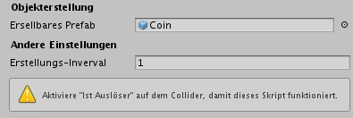

# Gameplay

Gameplay-Skripts sind verschiedene Arten von Skripts, um Gameplay-Effekte zu erzielen. Sie handeln auf eigene Faust, das heißt, sie benötigen keine [Bedingungen](de/components/conditions.md), um sie zu aktivieren.

## ObjectCreatorArea

!> Benötigt einen `BoxCollider2D`

`ObjectCreatorArea` ist ein Skript, das aus einem Prefab in einem rechteckigen Bereich neue Objekte generiert. Damit dies funktioniert ist ein `BoxCollider2D` erforderlich (wird automatisch angewendet), der den Bereich definiert, in dem die Instanzen angezeigt werden.

Die Eigenschaft `Ersellbares Prefab` kann ein Objekt aus der Szene sein. Es empfiehlt sich jedoch, ein Prefab zu erstellen und dieses stattdessen zuzuweisen. Wenn du ein normales GameObject aus der Szene zuweisen willst, zeigt das Skript eine Warnung an.

Die Eigenschaft `Spawn-Intervall` bestimmt das Intervall zwischen welchem Objekte generiert werden. Der Wert wird in Sekunden ausgedrückt.

## ObjectShooter

!> Benötigt _nichts_

`ObjectShooter` ist ein Skript, mit dem du beim Drücken einer Taste ein Prefab schießen kannst (standardmäßig Leertaste). Du kannst damit Waffen erstellen, die Projektile oder Laser abschießen, eine Tennisballmaschine oder jede Art von Gegenstand, der wiederholt etwas herauswirft. Es funktioniert in Verbindung mit [BulletAttribute](de/components/attributes.md#bulletattribute).

Häufig möchtest du dieses Skript einem leeren Objekt zuweisen, es einem anderen Objekt mit Grafiken übergeordnet und als Erstellungspunkt verwenden. Auf diese Weise kannst du genau steuern, von wo das Projektil geschossen wird.

Die Eigenschaft `Erstellbares Prefab` kann ein Objekt aus der Szene akzeptieren. Es empfiehlt sich jedoch, ein Prefab zu erstellen und dieses stattdessen zuzuweisen. Wenn du ein normales GameObject aus der Szene zuweist, zeigt das Skript eine Warnung an.

Die Eigenschaft `Erstellungs-Geschwindigkeit` steuert das Intervall zwischen den Schüssen in Sekunden. Die `Projektilgeschwindigkeit` bestimmt die Geschwindigkeit und die `Schussrichtung` die Richtung als `Vector2`.

Die Eigenschaft `Relativ zur Drehung` kann die oben genannte Richtung mit dem GameObject gedreht werden. Wenn du dieses Skript beispielsweise für ein Objekt wie ein Raumschiff verwendest, das sich dreht, ist die Schussrichtung realistisch. Wenn du diese Option deaktivierst, befindet sich die Schussrichtung im unabhängig vom Objekt.

Wenn du dieses Skript anwendst, wird in der Szenenansicht ein grüner Pfeil angezeigt.

Die Größe des Pfeils hängt nicht von der Stärke des Schusses ab.

> Hinweis: Du kannst die `Projektilgeschwindigkeit` auch auf `0` setzen. Auf diese Weise kann der Spieler Objekte zurücklassen, während er sich bewegt. Lass' dich nicht durch den Namen des Skripts täuschen, in dem von "Schießen" die Rede ist: Das generierte Objekt muss kein Projektil sein!

### Projektil IDs

Endlich hat `ObjectShooter` auch die Möglichkeit, den Projektilen eine Spieler-ID zuzuweisen. Dies funktioniert in Verbindung mit dem [BulletAttribute](de/components/attributes.md#bulletattribute)-Skript, das dem Projektil-Prefab zugewiesen werden muss, das du abschießen möchtest. Dies bedeutet, dass dem richtigen Spieler Punkte zugewiesen werden, wenn das Projektil auf ein anderes Objekt mit dem Skript [DestroyForPointsAttribute](de/components/attributes#destroyforpointsattribute) trifft.

Um sicherzustellen, dass `ObjectShooter` die richtige ID zuweist, musst du das GameObject als `Player` oder `Player2` kennzeichnen.

> Hinweis: Wenn du das GameObject nicht kennzeichnest (Tag setzen), wird davon ausgegangen, dass die Kugel von Player1 stammt. Bei Einzelspieler-Spielen müsst du dich also nicht um das Kennzeichnen kümmern.

## PickUpAndHold

!> Benötigt _nichts_

Dieses Skript wird verwendet, um einem Charakter die Fähigkeit zu geben, etwas wie einen Gegenstand oder einen Ball in einem Sportspiel aufzunehmen (und fallen zu lassen). In Verbindung mit der cleveren Verwendung eines [ConditionArea](de/components/conditions.md#conditionarea)-Skripts kannst du ein Gameplay erstellen, bei dem es darum geht, ein Objekt aufzunehmen und an einen bestimmten Bereich zu liefern.

Um ein Objekt "auswählbar" zu machen, musst du ihm das `Pickup` Tag zuweisen und ihm einen beliebigen `Collider2D` zuweisen. Wahrscheinlich möchtest du den Collider zum Auslöser machen, da sonst das Objekt mit dem Player kollidiert und schwerer zu erfassen ist. Wenn das Objekt einen `Rigidbody2D` hat, wird es auf "kinematisch" gestellt und gestoppt, bevor es dem Charakter übergeordnet wird.

`Aufheben-Taste` und `Fallen-Lassen-Taste` definieren, welche Taste gedrückt werden muss, um den Gegenstand aufzunehmen oder fallen zu lassen. Sie stimmen standardmäßig überein, müssen es aber nicht.

Die Eigenschaft `Aufheben-Reichweite` definiert die maximale Distanz, die das Objekt von dem Spieler haben kann, damit es aufgenommen werden kann. Wenn mehrere Aufnahmeobjekte vorhanden sind, wird das nächste aufgenommen.

## TimedSelfDestruct

!> Benötigt _nichts_

`TimedSelfDestruct` ist ein nützliches Skript zum Entfernen von Objekten, die nach einer bestimmten Zeit nicht mehr in der Szene benötigt werden. `Zerstörungstimer` ist die Zeit in Sekunden, nach der das Objekt verschwindet.

Verwende es für Projektile und generierte Objekte, um sicherzustellen, dass die Szene nicht überladen wird. Wenn dein Spiel viele Objekte generiert, kann es mit der Zeit auch langsamer werden. Das Setzen von `TimedSelfDestruct` auf diese Objekte - auch wenn der Timer hoch ist - hilft dem Spiel, besser zu laufen.
